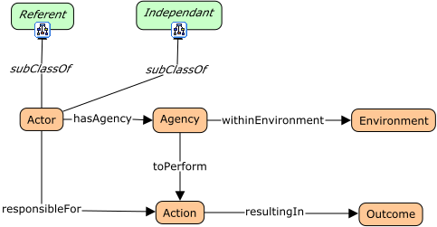
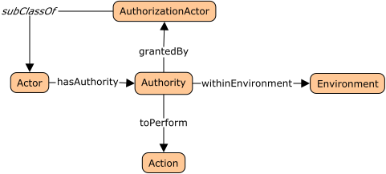
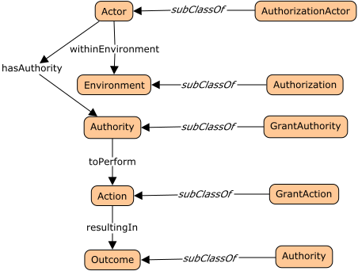

# Domain: Actors



<span class="figure caption">Actors Core</span>

## View: Authority



<span class="figure caption">Actors Authority</span>

## View: Authorization



<span class="figure caption">Actors Authorization</span>

## Classes

### Action

An intentional behavior performed by an actor resulting in some outcome.

```turtle
act:Action a rdfs:Class
  skos:prefLabel "Action"@en ;
  skos:definition 
    "An intentional behavior performed by an actor resulting in some outcome."@en.
```

### Actor

Some identifiable participant able to take certain actions within some scope or environment.

```turtle
act:Actor a rdfs:Class
  skos:prefLabel "Actor"@en ;
  skos:definition 
    "Some identifiable participant able to take certain actions within some scope or environment."@en.
```

### Agency

The ability, within some scope or environment, to perform an action or actions.

```turtle
act:Agency a rdfs:Class
  skos:prefLabel "Agency"@en ;
  skos:definition 
    "The ability, within some scope or environment, to perform an action or actions."@en.
```

### Authority

The permission granted by some actor with

### Authorization

### AuthorizationActor

### Environment

### GrantAction

### GrantAuthority

### Outcome

## Properties

Note that the property `subClassOf` is in italics because it is an RDF Schema,
or OWL, property.

### grantedBy

Denotes the relation between the claim of `Authority` held by the `Actor` and
the `AuthorizationActor` that granted it.

### hasAgency

### hasAuthority

### responsibleFor

### resultingIn

### toPerform

### withinEnvironment
