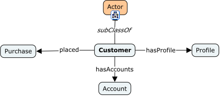
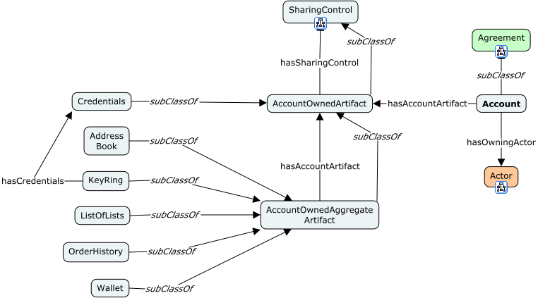
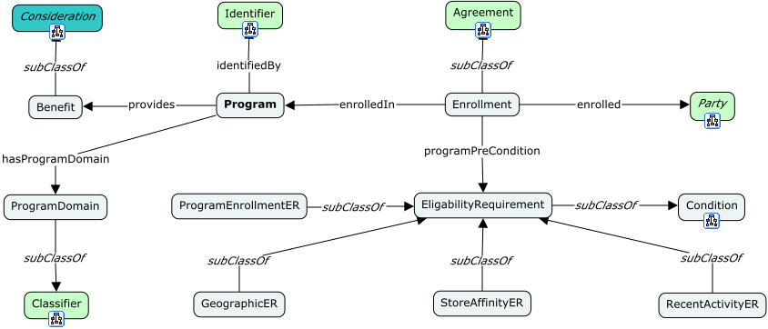
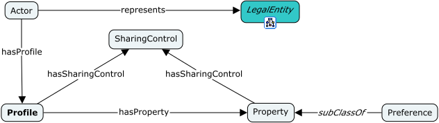
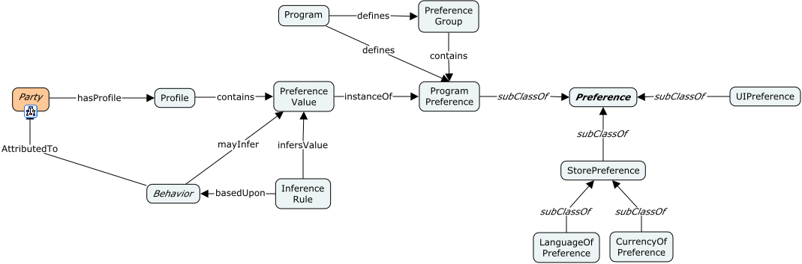
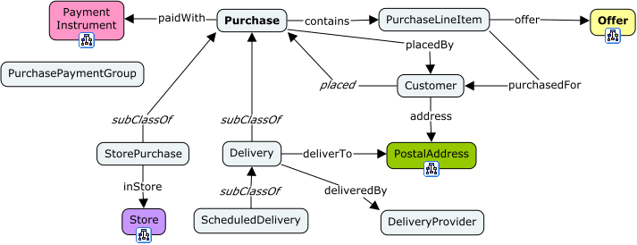

# Domain: Customers



<span class="figure caption">Customer Overview</span>

## View: Customer Accounts



<span class="figure caption">Customer Accounts</span>

## View: Customer Programs



<span class="figure caption">Customer Programs</span>

## View: Customer Profiles



<span class="figure caption">Customer Profiles</span>

## Views: Customer Preferences



<span class="figure caption">Customer Preferences</span>

## View: Customer Purchases



<span class="figure caption">Customer Purchases</span>

## Classes

### ClassName

Definition:

> ...

OWL:

```turtle
fnd:ClassName a rdfs:Class ;
  rdfs:subClassOf fnd:Thing ;
  skos:prefLabel "ClassName"@en ;
  skos:definition "..."@en .
```

## Properties

### a property

Definition:

> ...

```turtle
fnd:aProperty a rdfs:Property ;
  rdfs:domain fnd:Thing ;
  rdfs:range fnd:Thing ;
  skos:prefLabel "a propery"@en ;
  skos:definition "..."@en .
```
