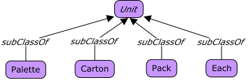
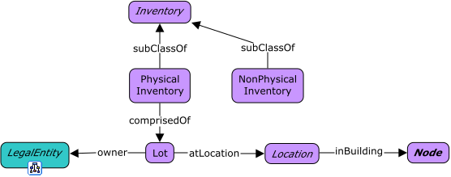
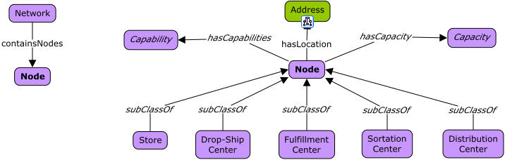
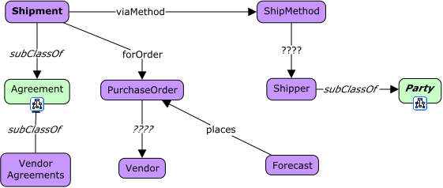

# Inventory

## View: Inventory Units



<span class="figure caption">Inventory Units</span>

## View: Inventory Breakdown



<span class="figure caption">Inventory Breakdown</span>

## View: Inventory Nodes



<span class="figure caption">Inventory Nodes</span>

## View: Inventory Shipments



<span class="figure caption">Inventory Shipments</span>

## Classes

### ClassName

Definition:

> ...

OWL:

```turtle
fnd:ClassName a rdfs:Class ;
  rdfs:subClassOf fnd:Thing ;
  skos:prefLabel "ClassName"@en ;
  skos:definition "..."@en .
```

## Properties

### a property

Definition:

> ...

```turtle
fnd:aProperty a rdfs:Property ;
  rdfs:domain fnd:Thing ;
  rdfs:range fnd:Thing ;
  skos:prefLabel "a propery"@en ;
  skos:definition "..."@en .
```
