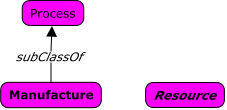
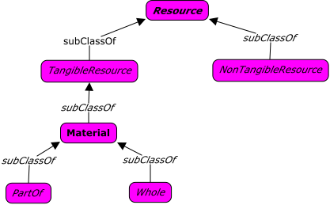
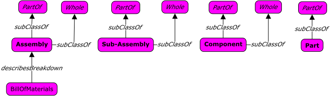
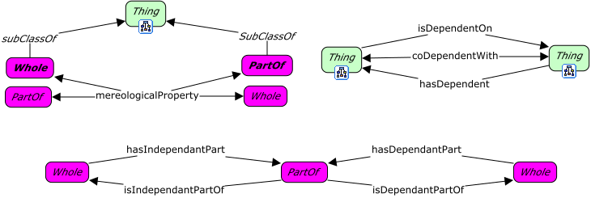

# Manufacturing



<span class="figure caption">Manufacturing Overview</span>

## View: Resources



<span class="figure caption">Manufacturing Resources</span>

## View: Assembly Breakdown



<span class="figure caption">Manufacturing Assembly Breakdown</span>

## View: Process


<span class="figure caption">Manufacturing Process</span>

## Classes

### Activity

Definition:

> TBD

OWL:

```turtle
:Activity a owl:Class ;
  rdfs:subClassOf fnd:Thing ;
  skos:prefLabel "Activity"@en .

```

### Assembly

Definition:

> TBD

OWL:

```turtle
:Assembly a owl:Class ;
  rdfs:subClassOf :PartOf, :Whole ;
  skos:prefLabel "Assembly"@en .
```

### Bill of materials

Definition:

> TBD

OWL:

```turtle
:BillOfMaterials a owl:Class ;
  rdfs:subClassOf fnd:Artifact ;
  skos:prefLabel "Bill of materials"@en .
```

### Component

Definition:

> TBD

OWL:

```turtle
:Component a owl:Class ;
  rdfs:subClassOf :PartOf, :Whole ;
  skos:prefLabel "Component"@en .
```

### Manufacture

Definition:

> TBD

OWL:

```turtle
:Manufacture a owl:Class ;
  rdfs:subClassOf :Process ;
  skos:prefLabel "Manufacture"@en .
```

### Material

Definition:

> TBD

OWL:

```turtle
:NonTangibleResource a owl:Class ;
  rdfs:subClassOf :Resource ;
  skos:prefLabel "Non-tangible resource"@en .
```

### Non-tangible resource

Definition:

> TBD

OWL:

```turtle
:NonTangibleResource a owl:Class ;
  rdfs:subClassOf :Resource ;
  skos:prefLabel "Non-tangible resource"@en .
```

### Part

Definition:

> TBD

OWL:

```turtle
:Part a owl:Class ;
  rdfs:subClassOf :PartOf ;
  skos:prefLabel "Part"@en .
```

### Part of

Definition:

> TBD

OWL:

```turtle
:PartOf a owl:Class ;
  rdfs:subClassOf :Material ;
  owl:disjointWith :Whole ;
  skos:altLabel "Meronym"@en ;
  skos:prefLabel "Part of"@en .
```

### Process

Definition:

> TBD

OWL:

```turtle
:Process a owl:Class ;
  rdfs:subClassOf fnd:Thing ;
  skos:prefLabel "Process"@en .
```

### Resource

Definition:

> A resource is anything that can be drawn upon to function, survive, or achieve a goal.

OWL:

```turtle
:Resource a owl:Class ;
  rdfs:subClassOf fnd:Thing ;
  skos:definition "..."@en ;
  skos:prefLabel "Resource"@en .
```

### Sub-assembly

Definition:

> TBD

OWL:

```turtle
:SubAssembly a owl:Class ;
  rdfs:subClassOf :PartOf, :Whole ;
  skos:prefLabel "Sub-assembly"@en .
```

### Tangible resource

Definition:

> TBD

OWL:

```turtle
:TangibleResource a owl:Class ;
  rdfs:subClassOf :Resource ;
  skos:prefLabel "Tangible resource"@en .
```

### Whole

Definition:

> TBD

OWL:

```turtle
:Whole a owl:Class ;
  rdfs:subClassOf :Material ;
  skos:altLabel "Holonym"@en ;
  skos:prefLabel "Whole"@en .
```

## Properties



<span class="figure caption">Manufacturing Properties</span>

### activity property

Definition:

> ...

OWL:

```turtle
:activityProperty a owl:ObjectProperty ;
  rdfs:subPropertyOf owl:topObjectProperty ;
  rdfs:domain [
    a owl:Class ;
    owl:unionOf (
      :Activity
      :Resource
    )
  ] ;
  rdfs:range [
    a owl:Class ;
    owl:unionOf (
      :Activity
      :Resource
    )
  ] ;
  skos:prefLabel "activity property"@en .
```

### assembles

Definition:

> ...

OWL:

```turtle
:assembles a owl:ObjectProperty ;
  rdfs:subPropertyOf :activityProperty ;
  rdfs:domain :Activity ;
  rdfs:range :Material ;
  skos:prefLabel "assembles"@en .
```

### codependent with

Definition:

> TBD

OWL:

```turtle
:codependentWith a owl:ObjectProperty, owl:SymmetricProperty ;
  rdfs:subPropertyOf :mereologicalProperty ;
  skos:prefLabel "co-dependent with"@en .
```

### consumes

Definition:

> ...

OWL:

```turtle
:consumes a owl:ObjectProperty ;
  rdfs:subPropertyOf :activityProperty ;
  rdfs:domain :Activity ;
  rdfs:range :Material ;
  skos:prefLabel "consumes"@en .
```

### details breakdown of

Definition:

> ...

OWL:

```turtle
:detailsBreakdownOf a owl:ObjectProperty ;
  rdfs:subPropertyOf owl:topObjectProperty ;
  rdfs:domain :BillOfMaterials ;
  rdfs:range :Assembly ;
  skos:prefLabel "details breakdown of"@en .
```

### has activity

Definition:

> ...

OWL:

```turtle
:hasActivity a owl:ObjectProperty ;
  rdfs:subPropertyOf :processProperty ;
  owl:inverseOf :isActivityWithin ;
  rdfs:domain :Process ;
  rdfs:range :Activity ;
  skos:prefLabel "has activity"@en .
```

### has dependent

Definition:

> TBD

OWL:

```turtle
:hasDependent a owl:ObjectProperty, owl:TransitiveProperty ;
  rdfs:subPropertyOf :mereologicalProperty ;
  owl:inverseOf :isDependentOn ;
  skos:prefLabel "has dependent"@en .
```

### has dependent part

Definition:

> TBD

OWL:

```turtle
:hasDependentPart a owl:ObjectProperty ;
  rdfs:subPropertyOf :hasPart ;
  owl:inverseOf :isDependentPartOf ;
  rdfs:range [
    a owl:Class ;
    owl:intersectionOf (
      fnd:DependentThing
      :PartOf
    )
  ] ;
  skos:prefLabel "has dependent part"@en .
```

### has independent part

Definition:

> TBD

OWL:

```turtle
:hasIndependentPart a owl:ObjectProperty ;
  rdfs:subPropertyOf :hasPart ;
  owl:inverseOf :isIndependentPartOf ;
  rdfs:range [
    a owl:Class ;
    owl:intersectionOf (
      fnd:IndependentThing
      :PartOf
    )
  ] ;
  skos:prefLabel "has independent part"@en .
```

### has part

Definition:

> TBD

OWL:

```turtle
:hasPart a owl:ObjectProperty, owl:TransitiveProperty ;
  rdfs:subPropertyOf :mereologicalProperty ;
  owl:inverseOf :isPartOf ;
  rdfs:domain :Whole ;
  rdfs:range :PartOf ;
  skos:altLabel "holonymy"@en ;
  skos:prefLabel "has part"@en .
```

### is activity within

Definition:

> TBD

OWL:

```turtle
:isActivityWithin a owl:ObjectProperty ;
  rdfs:subPropertyOf :processProperty ;
  rdfs:domain :Activity ;
  rdfs:range :Process ;
  skos:prefLabel "is activity within"@en .
```

### is co-dependent with

Definition:

> TBD

OWL:

```turtle
:isCodependentWith a owl:ObjectProperty, owl:SymmetricProperty ;
  rdfs:subPropertyOf :mereologicalProperty ;
  skos:prefLabel "is co-dependent with"@en .
```

### is dependent on

Definition:

> TBD

OWL:

```turtle
:isDependentOn a owl:ObjectProperty, owl:TransitiveProperty ;
  rdfs:subPropertyOf :mereologicalProperty ;
  skos:prefLabel "is dependent on"@en .
```

### is dependent part of

Definition:

> TBD

OWL:

```turtle
:isDependentPartOf a owl:ObjectProperty ;
  rdfs:subPropertyOf :isPartOf ;
  rdfs:domain [
    a owl:Class ;
    owl:intersectionOf (
      fnd:DependentThing
      :Whole
    )
  ] ;
  skos:prefLabel "is dependent part of"@en .
```

### is independent part of

Definition:

> TBD

OWL:

```turtle
:isIndependentPartOf a owl:ObjectProperty ;
  rdfs:subPropertyOf :isPartOf ;
  rdfs:domain [
    a owl:Class ;
    owl:intersectionOf (
      fnd:IndependentThing
      :Whole
    )
  ] ;
  skos:prefLabel "is independent part of"@en .
```

### is part of

Definition:

> TBD

OWL:

```turtle
:isPartOf a owl:ObjectProperty, owl:TransitiveProperty ;
  rdfs:subPropertyOf :mereologicalProperty ;
  rdfs:domain :PartOf ;
  rdfs:range :Whole ;
  skos:altLabel "meronymy"@en ;
  skos:prefLabel "is part of"@en .
```

### merelogical property

Definition:

> TBD

OWL:

```turtle
:mereologicalProperty a owl:ObjectProperty ;
  rdfs:subPropertyOf owl:topObjectProperty ;
  rdfs:domain [
    a owl:Class ;
    owl:unionOf (
      :PartOf
      :Whole
    )
  ] ;
  rdfs:range [
    a owl:Class ;
    owl:unionOf (
      :PartOf
      :Whole
    )
  ] ;
  skos:prefLabel "mereological property"@en .
```

### process property

Definition:

> TBD

OWL:

```turtle
:processProperty a owl:ObjectProperty ;
  rdfs:subPropertyOf owl:topObjectProperty ;
  skos:prefLabel "process property"@en .
```

### produces

Definition:

> TBD

OWL:

```turtle
:produces a owl:ObjectProperty ;
  rdfs:subPropertyOf :activityProperty ;
  rdfs:domain :Activity ;
  rdfs:range :Material ;
  skos:prefLabel "produces"@en .
```

### requires

Definition:

> TBD

OWL:

```turtle
:requires a owl:ObjectProperty ;
  rdfs:subPropertyOf :activityProperty ;
  rdfs:domain :Activity ;
  rdfs:range :Material ;
  skos:prefLabel "requires"@en .

```

### transforms

Definition:

> TBD

OWL:

```turtle
:transforms a owl:ObjectProperty ;
  rdfs:subPropertyOf :activityProperty ;
  rdfs:domain :Activity ;
  rdfs:range :Material ;
  skos:prefLabel "transforms"@en .
```

### waits for

Definition:

> TBD

OWL:

```turtle
:waitsFor a owl:ObjectProperty ;
  rdfs:subPropertyOf :activityProperty ;
  rdfs:domain :Activity ;
  rdfs:range :Activity ;
  skos:prefLabel "waits for"@en .
```
