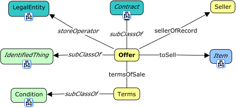
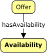
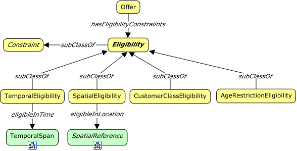
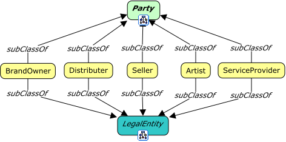

# Domain: Offers



<span class="figure caption">Offers Overview</span>

## View: Offer Availability



## View: Offer Eligibility

<span class="figure caption">Offer Availability</span>



<span class="figure caption">Offer Eligibility</span>

## View: Offer Parties



<span class="figure caption">Offer Parties</span>

## Classes

### Age restriction eligibility

Definition:

> ...

OWL:

```turtle
off:AgeRestrictionEligibility a rdfs:Class ;
  rdfs:subClassOf off:Eligibility ;
  skos:prefLabel "Age restriction eligibility"@en ;
  skos:definition "..."@en .
```

### Artist

Definition:

> ...

OWL:

```turtle
off:Artist a rdfs:Class ;
  rdfs:subClassOf fnd:Party, lgl:LegalEntity ;
  skos:prefLabel "Artist"@en ;
  skos:definition "..."@en .
```

### Brand owner

Definition:

> ...

OWL:

```turtle
off:BrandOwner a rdfs:Class ;
  rdfs:subClassOf fnd:Party, lgl:LegalEntity ;
  skos:prefLabel "Brand owner"@en ;
  skos:definition "..."@en .
```

### Constraint

Definition:

> ...

OWL:

```turtle
off:Constraint a rdfs:Class ;
  rdfs:subClassOf fnd:Thing ;
  skos:prefLabel "Constraint"@en ;
  skos:definition "..."@en .
```

### Customer class eligibility

Definition:

> ...

OWL:

```turtle
off:CustomerClassEligibility a rdfs:Class ;
  rdfs:subClassOf off:Eligibility ;
  skos:prefLabel "Customer class eligibility"@en ;
  skos:definition "..."@en .
```

### Distributer

Definition:

> ...

OWL:

```turtle
fnd:Distributer a rdfs:Class ;
  rdfs:subClassOf fnd:Party, lgl:LegalEntity ;
  skos:prefLabel "Distributer"@en ;
  skos:definition "..."@en .
```

### Eligibility

Definition:

> ...

OWL:

```turtle
off:Eligibility a rdfs:Class ;
  rdfs:subClassOf off:Constraint ;
  skos:prefLabel "Eligibility"@en ;
  skos:definition "..."@en .
```

### Offer

Definition:

> ...

OWL:

```turtle
off:Offer a rdfs:Class ;
  rdfs:subClassOf lgl:Consideration ;
  skos:prefLabel "Offer"@en ;
  skos:definition "..."@en .
```

### Seller

Definition:

> ...

OWL:

```turtle
off:Seller a rdfs:Class ;
  rdfs:subClassOf fnd:Party, lgl:LegalEntity ;
  skos:prefLabel "Seller"@en ;
  skos:definition "..."@en .
```

### Service provider

Definition:

> ...

OWL:

```turtle
off:ServiceProvider a rdfs:Class ;
  rdfs:subClassOf fnd:Party, lgl:LegalEntity ;
  skos:prefLabel "Service provider"@en ;
  skos:definition "..."@en .
```

### Spatial eligibility

Definition:

> ...

OWL:

```turtle
off:SpatialEligibility a rdfs:Class ;
  rdfs:subClassOf off:Eligibility ;
  skos:prefLabel "Spatial eligibility"@en ;
  skos:definition "..."@en .
```

### Temporal eligibility

Definition:

> ...

OWL:

```turtle
off:TemporalEligibility a rdfs:Class ;
  rdfs:subClassOf off:Eligibility ;
  skos:prefLabel "Temporal eligibility"@en ;
  skos:definition "..."@en .
```

### Term

Definition:

> ...

OWL:

```turtle
off:Term a rdfs:Class ;
  rdfs:subClassOf fnd:Condition ;
  skos:prefLabel "Term"@en ;
  skos:definition "..."@en .
```

## Properties

### eligible in location

Definition:

> ...

```turtle
off:eligibleInLocation a rdfs:Property ;
  rdfs:domain off:TemporalEligibility ;
  rdfs:range fnd:TemporalSpan ;
  skos:prefLabel "eligible in location"@en ;
  skos:definition "..."@en .
```

### eligible in time

Definition:

> ...

```turtle
off:eligibleInTime a rdfs:Property ;
  rdfs:domain off:SpatialEligibility ;
  rdfs:range fnd:SpatialReference ;
  skos:prefLabel "eligible in time"@en ;
  skos:definition "..."@en .
```

### has eligibility constraints

Definition:

> ...

```turtle
off:hasEligibilityConstraints a rdfs:Property ;
  rdfs:domain off:Offer ;
  rdfs:range off:Eligibility ;
  skos:prefLabel "has eligibility constraints"@en ;
  skos:definition "..."@en .
```

### seller of record

Definition:

> ...

```turtle
off:sellerOfRecord a rdfs:Property ;
  rdfs:domain off:Offer ;
  rdfs:range off:Seller ;
  skos:prefLabel "seller of record"@en ;
  skos:definition "..."@en .
```

### terms of sale

Definition:

> ...

```turtle
off:termsOfSale a rdfs:Property ;
  rdfs:domain off:Offer ;
  rdfs:range off:Term ;
  skos:prefLabel "terms of sale"@en ;
  skos:definition "..."@en .
```

### to sell

Definition:

> ...

```turtle
fnd:toSell a rdfs:Property ;
  rdfs:domain off:Offer ;
  rdfs:range off:Item ;
  skos:prefLabel "to sell"@en ;
  skos:definition "..."@en .
```
