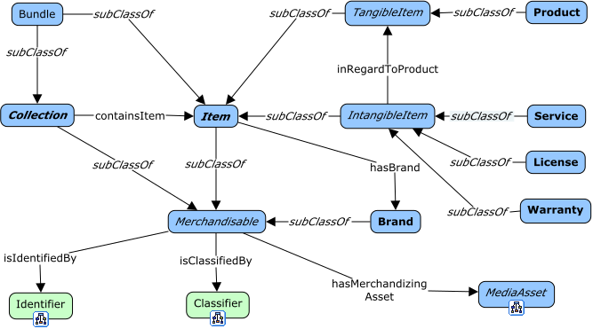
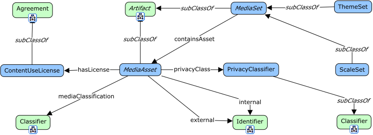
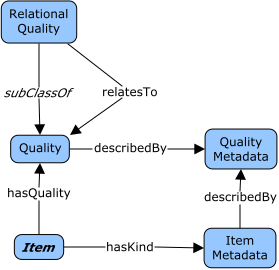
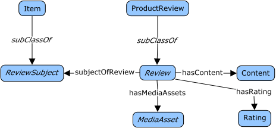

# Domain: Products

## View: Core



<span class="figure caption">Core</span>

## View: Media Assets



<span class="figure caption">Media Assets</span>

## View: Qualities



<span class="figure caption">Qualities</span>

## View: Customization

TBD

## View: Reviews



<span class="figure caption">Reviews</span>

## View: Lifecycle

TBD

## View: Safety

TBD

## Classes

### ClassName

Definition:

> ...

OWL:

```turtle
:ClassName a owl:Class ;
  rdfs:subClassOf fnd:Thing ;
  skos:prefLabel "ClassName"@en ;
  skos:definition "..."@en .
```

## Properties

### a property

Definition:

> ...

```turtle
:aProperty a owl:ObjectProperty ;
  rdfs:domain fnd:Thing ;
  rdfs:range fnd:Thing ;
  skos:prefLabel "a propery"@en ;
  skos:definition "..."@en .
```
