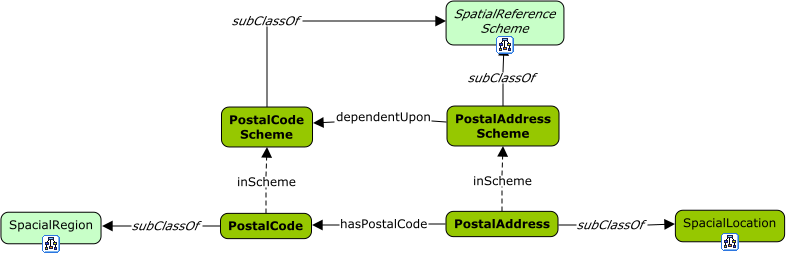
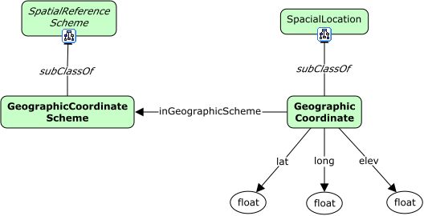

# Domain: Spatial

## View: Postal Schemes



<span class="figure caption">Postal Addressing Schemes</span>

## View: Geographic Coordinate Scheme



<span class="figure caption">Geographic Coordinate Scheme</span>

## Classes

### Geographic Coordinate

```turtle
fnd:GeographicCoordinate a rdfs:Class ;
  rdfs:subClassOf fnd:SpacialLocation ;
  skos:prefLabel "GeographicCoordinate"@en ;
  skos:definition ""@en .
```

### Geographic Coordinate Scheme

```turtle
fnd:GeographicCoordinateScheme a rdfs:Class ;
  rdfs:subClassOf fnd:SpacialReferenceScheme ;
  skos:prefLabel "GeographicCoordinateScheme"@en ;
  skos:definition ""@en .
```

### Postal Address

```turtle
fnd:PostalAddress a rdfs:Class ;
  rdfs:subClassOf fnd:SpacialLocation ;
  skos:prefLabel "PostalAddress"@en ;
  skos:definition ""@en .
```

### Postal Address Scheme

```turtle
fnd:PostalAddressScheme a rdfs:Class ;
  rdfs:subClassOf fnd:SpacialReferenceScheme ;
  skos:prefLabel "PostalAddressScheme"@en ;
  skos:definition ""@en .
```

### Postal Code

```turtle
fnd:PostalCode a rdfs:Class ;
  rdfs:subClassOf fnd:SpacialLocation ;
  skos:prefLabel "PostalCode"@en ;
  skos:definition ""@en .
```

### Postal Code Scheme

```turtle
fnd:PostalCodeScheme a rdfs:Class ;
  rdfs:subClassOf fnd:SpacialReferenceScheme ;
  skos:prefLabel "PostalCodeScheme"@en ;
  skos:definition ""@en .
```

## Properties

### hasPostalCode

```turtle
fnd:hasPostalCode a rdfs:Property ;
  rdfs:domain fnd:PostalAddress ;
  rdfs:range fnd:PostalCode ;
  skos:prefLabel "hasPostalCode"@en ;
  skos:definition ""@en .
```

### inGeographicScheme

```turtle
fnd:inGeographicScheme a rdfs:Property ;
  rdfs:subPropertyOf fnd:inScheme ;
  rdfs:domain fnd:GeographicCoordinate ;
  rdfs:range fnd:GeographicCoordinateScheme ;
  skos:prefLabel "inGeographicScheme"@en ;
  skos:definition ""@en .
```
