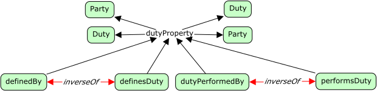

# Agreements


<span class="figure caption">Agreements</span>

## Classes

### Agreement

Definition:

> An agreement is a mutual arrangement between two or more *parties* performing
> defined *duties* (or rôles), agreeing on certain *outcomes*, or actions, and
> obeying certain *conditions*.

OWL:

```turtle
fnd:Agreement a owl:Class ;
  rdfs:subClassOf fnd:Thing ;
  skos:prefLabel "Agreement"@en ;
  skos:definition "..."@en .
```

### Condition

Definition:

> A condition is some restriction on one or more *party*, or on the environment
> the parties act within for the duration of the agreement.

```turtle
fnd:Condition a owl:Class ;
  rdfs:subClassOf fnd:DependentThing ;
  skos:prefLabel "Condition"@en ;
  skos:definition "..."@en .
```

### Duty

Definition:

> One or more activities assigned to a party in an agreement; in some cases
> this allows for *template* agreements where the party can be simple replaced
> at some point for the named *duty*.

```turtle
fnd:Duty a owl:Class ;
  rdfs:subClassOf fnd:DependentThing ;
  skos:prefLabel "Duty"@en ;
  skos:definition "..."@en .
```

### Outcome

Definition:

> Some expected future state, some created artifact or financial instrument,
> or some performed action.

```turtle
fnd:Outcome a owl:Class ;
  dfs:subClassOf fnd:DependentThing ;
  skos:prefLabel "Outcome"@en ;
  skos:definition "..."@en .
```

### Party

Definition:

> A participant within the *agreement* having one or more *duties* to perform.

```turtle
fnd:Party a owl:Class ;
  dfs:subClassOf fnd:Thing ;
  skos:prefLabel "Party"@en ;
  skos:definition "..."@en .
```

## Properties



<span class="figure caption">Agreement Properties</span>

### a party to

Definition:

> Denotes that this party plays a role within the related agreement.

```turtle
fnd:aPartyTo a owl:ObjectProperty ;
  owl:inverseOf includesParty ;
  rdfs:domain fnd:Party ;
  rdfs:range fnd:Agreement ;
  skos:prefLabel "a party to"@en ;
  skos:definition "..."@en .
```

### defines duty

Definition:

> ...

```turtle
fnd:definesDuty a owl:ObjectProperty ;
  rdfs:subPropertyOf fnd:dutyProperty ;
  owl:inverseOf fnd:performedInScope ;
  rdfs:domain fnd:Agreement ;
  rdfs:range fnd:Duty ;
  skos:prefLabel "defines duty"@en ;
  skos:definition "..."@en .
```

### duty performed by

Definition:

> ...

```turtle
fnd:dutyPerformedBy a owl:ObjectProperty ;
  rdfs:subPropertyOf fnd:dutyProperty ;
  owl:inverseOf fnd:performsDuty ;
  rdfs:domain fnd:Duty ;
  rdfs:range fnd:Party ;
  skos:prefLabel "duty performed by"@en ;
  skos:definition "..."@en .
```

### duty property

Definition:

> ...

```turtle
fnd:dutyProperty a owl:ObjectProperty ;
  skos:prefLabel "duty property"@en ;
  skos:definition "..."@en .
```

### effective timespan

Definition:

> This agreement is valid for the associated time span.

```turtle
fnd:effectiveTimespan a owl:ObjectProperty ;
  rdfs:domain fnd:Agreement ;
  rdfs:range fnd:TemporalSpanReference ;
  skos:prefLabel "effective timespan"@en ;
  skos:definition "..."@en .
```

### has condition

Definition:

> This agreement includes this condition.

```turtle
fnd:hasCondition a owl:ObjectProperty ;
  rdfs:domain fnd:Agreement ;
  rdfs:range fnd:Condition ;
  skos:prefLabel "has condition"@en ;
  skos:definition "..."@en .
```

### includes party

Definition:

> This agreement includes this party.

```turtle
fnd:includesParty a owl:ObjectProperty ;
owl:inverseOf aPartyTo ;
  rdfs:domain fnd:Agreement ;
  rdfs:range fnd:Party ;
  skos:prefLabel "includes party"@en ;
  skos:definition "..."@en .
```

### performed in scope

Definition:

> ...

```turtle
fnd:performedInScope a owl:ObjectProperty ;
  owl:inverseOf fnd:definesDuty ;
  rdfs:domain fnd:Duty ;
  rdfs:range fnd:Agreement ;
  skos:prefLabel "performed in scope"@en ;
  skos:definition "..."@en .
```

### performs duty

Definition:

> ...

```turtle
fnd:performsDuty a owl:ObjectProperty ;
  owl:inverseOf fnd:dutyPerformedBy ;
  rdfs:domain fnd:Party ;
  rdfs:range fnd:Duty ;
  skos:prefLabel "performs duty"@en ;
  skos:definition "..."@en .
```
