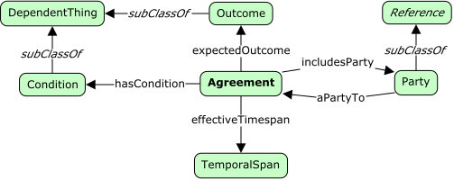

# Agreements



<span class="figure caption">Agreements</span>

## Classes

### Agreement

Definition:

> An agreement is a mutual arrangement between two or more *parties* agreeing
> on certain *outcomes* or duties within certain *conditions*.

OWL:

```turtle
fnd:Agreement a rdfs:Class ;
  rdfs:subClassOf fnd:Thing ;
  skos:prefLabel "Agreement"@en ;
  skos:definition "..."@en .
```

### Condition

Definition:

> A condition is some restriction on one or more party, or on the environment
> the parties act within for the duration of the agreement.

```turtle
fnd:Condition a rdfs:Class ;
  rdfs:subClassOf fnd:DependentThing ;
  skos:prefLabel "Condition"@en ;
  skos:definition "..."@en .
```

### Outcome

Definition:

> Some expected future state, some created artifact or financial instrument,
> or some performed action.

```turtle
fnd:Outcome a rdfs:Class ;
  dfs:subClassOf fnd:DependentThing ;
  skos:prefLabel "Outcome"@en ;
  skos:definition "..."@en .
```

### Party

Definition:

> A participant within the agreement having some role to perform.

```turtle
fnd:Party a rdfs:Class ;
  dfs:subClassOf fnd:Reference ;
  skos:prefLabel "Party"@en ;
  skos:definition "..."@en .
```

## Properties

### a party to

Definition:

> Denotes that this party plays a role within the related agreement.

```turtle
fnd:aPartyTo a rdfs:Property ;
  owl:inverseOf includesParty ;
  rdfs:domain fnd:Party ;
  rdfs:range fnd:Agreement ;
  skos:prefLabel "a party to"@en ;
  skos:definition "..."@en .
```

### includes party

Definition:

> This agreement includes this party.

```turtle
fnd:includesParty a rdfs:Property ;
owl:inverseOf aPartyTo ;
  rdfs:domain fnd:Agreement ;
  rdfs:range fnd:Party ;
  skos:prefLabel "includes party"@en ;
  skos:definition "..."@en .
```

### has condition

Definition:

> This agreement includes this condition.

```turtle
fnd:hasCondition a rdfs:Property ;
  rdfs:domain fnd:Agreement ;
  rdfs:range fnd:Condition ;
  skos:prefLabel "has condition"@en ;
  skos:definition "..."@en .
```

### effective timespan

Definition:

> This agreement is valid for the associated time span.

```turtle
fnd:effectiveTimespan a rdfs:Property ;
  rdfs:domain fnd:Agreement ;
  rdfs:range fnd:TemporalSpanReference ;
  skos:prefLabel "effective timespan"@en ;
  skos:definition "..."@en .
```
