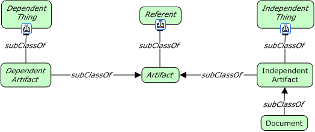
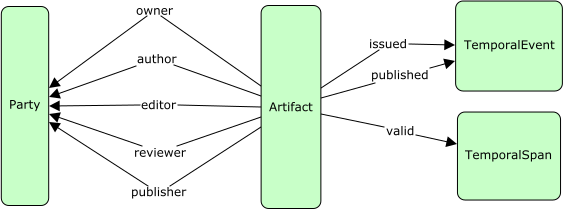

# Artifacts



<span class="figure caption">Artifacts</span>

## Classes

TBD

### Artifact

Definition:

>

OWL:

```turtle
fnd:Artifact a owl:Class ;
  dfs:subClassOf fnd:Referent ;
  skos:prefLabel "Artifact"@en ;
  skos:definition ""@en .
```

### Dependent artifact

Definition:

>

OWL:

```turtle
fnd:DependentArtifact a owl:Class ;
  dfs:subClassOf fnd:DependentThing, fnd:Artifact ;
  skos:prefLabel "Dependent artifact"@en ;
  skos:definition ""@en .
```

Definition:

>

OWL:

### Document

Definition:

>

OWL:

```turtle
fnd:Document a owl:Class ;
  dfs:subClassOf fnd:Artifact ;
  skos:prefLabel "Document"@en ;
  skos:definition ""@en .
```

### Independent artifact

Definition:

>

OWL:

```turtle
fnd:IndependentArtifact a owl:Class ;
  dfs:subClassOf fnd:IndependentThing, fnd:Artifact ;
  skos:prefLabel "Independent artifact"@en ;
  skos:definition ""@en .
```

## Properties



### artifact property

Definition:

> A property on some *thing* whose value is an artifact.

OWL:

```turtle
fnd:artifactProperty a owl:ObjectProperty ;
  rdfs:domain fnd:Thing ;
  rdfs:range fnd:Artifact ;
  skos:prefLabel "artifact property"@en ;
  skos:definition "A property on some *thing* whose value is an artifact."@en ;
  skos:example "The property `author`, as a sub-property, is a relation from a party to an artifact.".
```

### party property of artifact

Definition:

> A property of an artifact whose value is a party.

OWL:

```turtle
fnd:partyPropertyOfArtifact a owl:ObjectProperty ;
  rdfs:subClassOf fnd:propertyOfArtifact ;
  rdfs:domain fnd:Artifact ;
  rdfs:range fnd:Party ;
  skos:prefLabel "A property of an artifact whose value is a party."@en ;
  skos:definition ""@en .
```

### property of artifact

Definition:

> A property of an artifact, the type of which is unknown.

OWL:

```turtle
fnd:propertyOfArtifact a owl:ObjectProperty ;
  rdfs:domain fnd:Artifact ;
  rdfs:range fnd:Thing ;
  skos:prefLabel "property of artifact"@en ;
  skos:definition "A property of an artifact, the type of which is unknown."@en .
```

### temporal event property of artifact

Definition:

> A property of an artifact whose value is a point in time (temporal event).

OWL:

```turtle
fnd:temporalEventPropertyOfArtifact a owl:ObjectProperty ;
  rdfs:subClassOf fnd:propertyOfArtifact ;
  rdfs:domain fnd:Artifact ;
  rdfs:range fnd:TemporalEvent ;
  skos:prefLabel "temporal event property of artifact"@en ;
  skos:definition "A property of an artifact whose value is a point in time (temporal event)."@en .
```

### temporal span property of artifact

Definition:

> A property of an artifact whose value is a span in time (temporal span).

OWL:

```turtle
fnd:temporalSpanPropertyOfArtifact a owl:ObjectProperty ;
  rdfs:subClassOf fnd:propertyOfArtifact ;
  rdfs:domain fnd:Artifact ;
  rdfs:range fnd:TemporalSpan ;
  skos:prefLabel "temporal span property of artifact"@en ;
  skos:definition "A property of an artifact whose value is a span in time (temporal span)."@en ;
  skos:example "A sub-class of this property may be `validityDuration` for artifacts that expire.".
```
