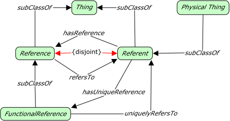

# Core



<span class="figure caption">Foundation Core</span>

## Classes

### Functional Reference

```turtle
fnd:FunctionalReference a rdfs:Class ;
  rdfs:subClassOf fnd:Reference ;
  skos:prefLabel "Functional Reference"@en ;
  skos:definition ""@en .
```

### Physical Thing

```turtle
fnd:PhysicalThing a rdfs:Class ;
  rdfs:subClassOf fnd:Referent ;
  skos:prefLabel "PhysicalThing"@en ;
  skos:definition ""@en .
```

### Reference

```turtle
fnd:Reference a rdfs:Class ;
  rdfs:subClassOf fnd:Thing ;
  owl:disjointWith fnd:Referent ;
  skos:prefLabel "Reference"@en ;
  skos:definition ""@en .
```

### Referent

```turtle
fnd:Referent a rdfs:Class ;
  rdfs:subClassOf fnd:Thing ;
  owl:disjointWith fnd:Reference ;
  skos:prefLabel "Referent"@en ;
  skos:definition ""@en .
```

### Thing

```turtle
fnd:Thing a rdfs:Class ;
  rdfs:subClassOf owl:Thing ;
  skos:prefLabel "Thing"@en ;
  skos:definition ""@en .
```

## Properties

### has Reference

```turtle
fnd:hasReference a rdfs:Property ;
  owl:inverseOf fnd:refersTo ;
  rdfs:domain fnd:Referent ;
  rdfs:range fnd:Reference ;
  skos:prefLabel "hasReference"@en ;
  skos:definition ""@en .
```

### has Unique Reference

```turtle
fnd:hasUniqueReference a rdfs:Property ;
  rdfs:subPropertyOf hasReference ;
  owl:inverseOf fnd:uniquelyRefersTo ;
  rdfs:domain fnd:Referent ;
  rdfs:range fnd:FunctionalReference ;
  skos:prefLabel "hasUniqueReference"@en ;
  skos:definition ""@en .
```

### refers To

```turtle
fnd:refersTo a rdfs:Property ;
  owl:inverseOf fnd:hasReference ;
  rdfs:domain fnd:Reference ;
  rdfs:range fnd:Referent ;
  skos:prefLabel "refersTo"@en ;
  skos:definition ""@en .
```

### uniquely Refer To

```turtle
fnd:uniquelyRefersTo a owl:FunctionalProperty ;
  rdfs:subPropertyOf fnd:refersTo ;
  owl:inverseOf fnd:hasUniqueReference ;
  rdfs:domain fnd:FunctionalReference ;
  rdfs:range fnd:Referent ;
  skos:prefLabel "uniquelyRefersTo"@en ;
  skos:definition ""@en .
```
