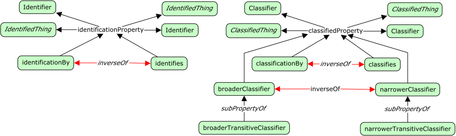

# Identity Aspects

Identity, and classification, are important in many ontologies; for example,
we make use of IRIs to identify classes and property definitions in our
ontologies and classify classes and properties as SKOS concepts as appropriate.
In this section we provide the ability to define *schemes* which describe the
namespace, rules, and authority for a set *things* and then go on to define
*classifier* and *identifier* schemes.


<span class="figure caption">Identity Aspect Classes</span>

## Classes

### Classification scheme

Definition:

> A classification scheme provides a reference and scope for a set of *classifiers*.

OWL:

```turtle
fnd:ClassificationScheme a owl:Class ;
  rdfs:subClassOf fnd:Scheme ;
  skos:prefLabel "Classification scheme"@en ;
  skos:definition "..."@en .
```

### Classified thing

Definition:

> A thing to which *classifiers* have been/may be attached.

OWL:

```turtle
fnd:ClassifiedThing a owl:Class ;
  rdfs:subClassOf fnd:Thing ;
  skos:prefLabel "Classified thing"@en ;
  skos:definition "..."@en .
```

### Classifier

Definition:

> A *classifier* is used to denote a group to which one more *things* belongs,
> within some *classification scheme*.

OWL:

```turtle
fnd:Classifier a owl:Class ;
  rdfs:subClassOf fnd:Reference ;
  skos:prefLabel "Classifier"@en ;
  skos:definition "..."@en .
```

### Functional identifier

Definition:

> TBD

OWL:

```turtle
fnd:FunctionalIdentifier a owl:Class ;
  rdfs:subClassOf fnd:Identifier ;
  skos:prefLabel "Functional identifier"@en ;
  skos:definition ""@en .
```

### Identification scheme

Definition:

> An identification scheme provides a reference and scope for a set of *identifiers*.

OWL:

```turtle
fnd:IdentificationScheme a owl:Class ;
  rdfs:subClassOf fnd:Scheme ;
  skos:prefLabel "Identification scheme"@en ;
  skos:definition "..."@en .
```

### Identified thing

Definition:

> A thing to which *identifiers* have been/may be attached.

OWL:

```turtle
fnd:IdentifiedThing a owl:Class ;
  rdfs:subClassOf fnd:Thing ;
  skos:prefLabel "Identified thing"@en ;
  skos:definition "..."@en .
```

### Identifier

Definition:

> TBD

OWL:

```turtle
fnd:Identifier a owl:Class ;
  rdfs:subClassOf fnd:Reference ;
  skos:prefLabel "Identifier"@en ;
  skos:definition ""@en .
```

### Scheme

Definition:

> A *scheme* is an *agreement* to use a common format, a common style or namespace.

Examples:

1. The GS1 Global Trade Identification Number (GTIN).
2. The International Standard Book Number (ISBN).

OWL:

```turtle
fnd:Scheme a owl:Class ;
  rdfs:subClassOf fnd:Agreement ;
  skos:prefLabel "Scheme"@en ;
  skos:definition "..."@en ;
  skos:example "..." .
```

## Properties



<span class="figure caption">IdentitAspect Properties</span>

### authority

Definition:

> Denotes that one *party* in the scheme's agreement with *responsibility*
> for management of the scheme; for example, setting rules and arbitrating
> issues.

Example:

1. The GTIN scheme has the organization GS1 as it's *authority*. \
   `gtin: :authority gs1: .`

OWL:

```turtle
fnd:authority a owl:ObjectProperty ;
  rdfs:subPropertyOf fnd:includesParty ;
  owl:inverseOf fnd:authorityForScheme ;
  rdfs:domain fnd:Scheme ;
  rdfs:range fnd:Party ;
  skos:prefLabel "authority"@en ;
  skos:definition "..."@en ;
  skos:example "..."@en .
```

### authority for scheme

Definition:

> Denotes a *scheme* which this *party* has authority over.

Example:

1. GS1 is the *authority for* the GTIN scheme. \
   `gs1: :authorityForScheme gtin: .`

OWL:

```turtle
fnd:authorityForScheme a owl:ObjectProperty ;
  rdfs:subPropertyOf fnd:aPartyTo ;
  owl:inverseOf fnd:authority ;
  rdfs:domain fnd:Party ;
  rdfs:range fnd:Scheme ;
  skos:prefLabel "authority for scheme"@en ;
  skos:definition ""@en ;
  skos:example "..."@en .
```

### broader classifier

Definition:

> TBD

Example:

1. Toy is a *broader classifier* than building bricks. \
   `ex:Toys :broaderClassifier :BuildingBricks .`
2. Furniture is a *broader classifier* than chairs. \
   `ex:Furniture :broaderClassifier :Chairs .`
3. Science and Technology is a is a *broader classifier* than Computer Science. \
   `ex:ScienceAndTechnology :broaderClassifier ex:ComputerScience .`

OWL:

```turtle
fnd:broaderClassifier a owl:ObjectProperty ;
  owl:inverseOf fnd:narrowerClassifier ;
  rdfs:domain fnd:Classifier ;
  rdfs:range fnd:Classifier ;
  skos:prefLabel "broader classifier"@en ;
  skos:definition ""@en ;
  skos:example "..."@en .
```

### broader transitive classifier

Definition:

> TBD

Example:

1. If building bricks is a *broader transitive classifier* than Legos, and
   toys is a *broader transitive classifier* than building bricks, then toys
   is a *broader transitive classifier* than Legos.

OWL:

```turtle
fnd:broaderTransitiveClassifier a owl:TransitiveProperty ;
  owl:inverseOf fnd:narrowerTransitiveClassifier ;
  rdfs:domain fnd:Classifier ;
  rdfs:range fnd:Classifier ;
  skos:prefLabel "broader transitive classifier"@en ;
  skos:definition ""@en ;
  skos:example "..."@en .
```

### classified by

Definition:

> TBD

Example:

1. The thing `<https://dl.acm.org/doi/book/10.1145/3382097>` is *classified by* `Computer Science`.

OWL:

```turtle
fnd:classifiedBy a owl:ObjectProperty ;
  rdfs:domain fnd:ClassifiedThing ;
  rdfs:range fnd:Classifier ;
  skos:prefLabel "classified by"@en ;
  skos:definition ""@en ;
  skos:example "..."@en .
```

### classifies

Definition:

> TBD

Example:

1. The classifier `Computer Science` *classifies* the thing `<https://dl.acm.org/doi/book/10.1145/3382097>`.

OWL:

```turtle
fnd:classifies a owl:ObjectProperty ;
  rdfs:domain fnd:Classifier ;
  rdfs:range fnd:ClassifiedThing ;
  skos:prefLabel "classifies"@en ;
  skos:definition ""@en ;
  skos:example "..."@en .
```

### identified by

Definition:

> TBD

Example:

1. The thing `<https://dl.acm.org/doi/book/10.1145/3382097>` is *identified by* `urn:isbn:978-1-4503-7617-4`.

OWL:

```turtle
fnd:identifiedBy a owl:ObjectProperty ;
  rdfs:domain fnd:IdentifiedThing ;
  rdfs:range fnd:Identifier ;
  skos:prefLabel "identified by"@en ;
  skos:definition ""@en 
  skos:example "..." .
```

### identifies

Definition:

> TBD

Example:

1. The identifier `urn:isbn:978-1-4503-7617-4` *identifies* the thing `<https://dl.acm.org/doi/book/10.1145/3382097>`.

OWL:

```turtle
fnd:identifiesa owl:ObjectProperty ;
  rdfs:domain fnd:Identifier ;
  rdfs:range fnd:IdentifiedThing ;
  skos:prefLabel "identifies"@en ;
  skos:definition ""@en  ;
  skos:example "..." .
```

### in classification scheme

Definition:

> TBD

OWL:

```turtle
fnd:inClassificationScheme a owl:ObjectProperty ;
  rdfs:domain fnd:Classifier ;
  rdfs:range fnd:ClassificationScheme ;
  skos:prefLabel "in classification scheme"@en ;
  skos:definition ""@en .
```

### in identification scheme

Definition:

> TBD

OWL:

```turtle
fnd:inIdentificationScheme a owl:ObjectProperty ;
  rdfs:domain fnd:Identifier ;
  rdfs:range fnd:IdentificationScheme ;
  skos:prefLabel "in identification scheme"@en ;
  skos:definition ""@en ;
  skos:example "..."@en .
```

### narrower classifier

Definition:

> TBD

Example:

1. Building bricks is a *narrower classifier* than toys. \
   `ex:BuildingBricks :narrowerClassifier ex:Toys .`
2. Chairs is a *narrower classifier* than furniture. \
   `ex:Chairs :narrowerClassifier ex:Furniture .`
3. `Computer Science` is a is a *narrower classifier* than `Science and Technology`. \
   `ex:ComputerScience :narrowerClassifier ex:ScienceAndTechnology .`

OWL:

```turtle
fnd:narrowerClassifier a owl:ObjectProperty ;
  owl:inverseOf fnd:broaderClassifier ;
  rdfs:domain fnd:Classifier ;
  rdfs:range fnd:Classifier ;
  skos:prefLabel "narrower classifier"@en ;
  skos:definition ""@en ; 
  skos:example "..." .
```

### narrower transitive classifier

Definition:

> TBD

OWL:

```turtle
fnd:narrowerTransitiveClassifier a owl:TransitiveProperty ;
  owl:inverseOf fnd:broaderTransitiveClassifier ;
  rdfs:domain fnd:Classifier ;
  rdfs:range fnd:Classifier ;
  skos:prefLabel "narrower transitive classifier"@en ;
  skos:definition ""@en .
```
