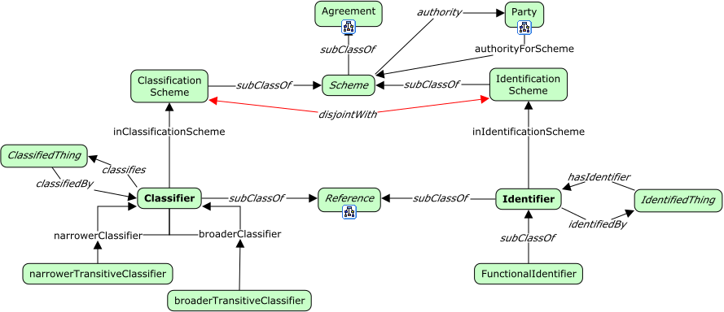

# Identity Aspects



<span class="figure caption">Identity Aspects</span>

## Classes

### Classification scheme

Definition:

> A *classification scheme* names and provides a scope for a set of *classifiers*.

OWL:

```turtle
fnd:ClassificationScheme a rdfs:Class ;
  rdfs:subClassOf fnd:Scheme ;
  skos:prefLabel "Classification scheme"@en ;
  skos:definition "..."@en .
```

### Classifier

Definition:

> A *classifier*

OWL:

```turtle
fnd:Classifier a rdfs:Class ;
  rdfs:subClassOf fnd:Reference ;
  skos:prefLabel "Classifier"@en ;
  skos:definition "..."@en .
```

### Functional identifier

Definition:

> TBD

OWL:

```turtle
fnd:FunctionalIdentifier a rdfs:Class ;
  rdfs:subClassOf fnd:Identifier ;
  skos:prefLabel "Functional identifier"@en ;
  skos:definition ""@en .
```

### Identification scheme

Definition:

> An *identification scheme* names and provides a scope for a set of *identifiers*.

OWL:

```turtle
fnd:IdentificationScheme a rdfs:Class ;
  rdfs:subClassOf fnd:Scheme ;
  skos:prefLabel "Identification scheme"@en ;
  skos:definition "..."@en .
```

### Identifier

Definition:

> TBD

OWL:

```turtle
fnd:Identifier a rdfs:Class ;
  rdfs:subClassOf fnd:Reference ;
  skos:prefLabel "Identifier"@en ;
  skos:definition ""@en .
```

### Scheme

Definition:

> A *scheme* is an *agreement* to use a common format, a common style or namespace.

Examples:

1. The GS1 Global Trade Identification Number (GTIN).
2. The International Standard Book Number (ISBN).

OWL:

```turtle
fnd:Scheme a rdfs:Class ;
  rdfs:subClassOf fnd:Agreement ;
  skos:prefLabel "Scheme"@en ;
  skos:definition "..."@en ;
  skos:example "...".
```

## Properties

### broader classifier

Definition:

> TBD

Example:

1. Toy is a broader classifier than building bricks.
2. Furniture is a broader classifier than chairs.

OWL:

```turtle
fnd:broaderClassifier a rdfs:Property ;
  owl:inverseOf fnd:narrowerClassifier ;
  rdfs:domain fnd:Classifier ;
  rdfs:range fnd:Classifier ;
  skos:prefLabel "broader classifier"@en ;
  skos:definition ""@en .
```

### broader transitive classifier

Definition:

> TBD

Example:

1. If building bricks is a broader classifier than Legos.
2. If toys is a broader classifier than building bricks.
3. Then, transitively, toys is a broader classifier that Legos.

OWL:

```turtle
fnd:broaderTransitiveClassifier a owl:TransitiveProperty ;
  owl:inverseOf fnd:narrowerTransitiveClassifier ;
  rdfs:domain fnd:Classifier ;
  rdfs:range fnd:Classifier ;
  skos:prefLabel "broader transitive classifier"@en ;
  skos:definition ""@en .
```

### in classification scheme

Definition:

> TBD

OWL:

```turtle
fnd:inClassificationScheme a rdfs:Property ;
  rdfs:domain fnd:Classifier ;
  rdfs:range fnd:ClassificationScheme ;
  skos:prefLabel "in classification scheme"@en ;
  skos:definition ""@en .
```

### in identification scheme

Definition:

> TBD

Example:

1. If building bricks is a broader classifier than Legos, and toys is a broader
   classifier than building bricks, then toys is a broader classifier than
   Legos.

OWL:

```turtle
fnd:inIdentificationScheme a rdfs:Property ;
  rdfs:domain fnd:Identifier ;
  rdfs:range fnd:IdentificationScheme ;
  skos:prefLabel "in identification scheme"@en ;
  skos:definition ""@en ;
  skos:example "..."@en .
```

### narrower classifier

Definition:

> TBD

Example:

1. Building bricks is a narrower classifier than toys.
2. Chairs is a narrower classifier than furniture.

OWL:

```turtle
fnd:narrowerClassifier a rdfs:Property ;
  owl:inverseOf fnd:broaderClassifier ;
  rdfs:domain fnd:Classifier ;
  rdfs:range fnd:Classifier ;
  skos:prefLabel "narrower classifier"@en ;
  skos:definition ""@en ; 
  skos:example "..." .
```

### narrower transitive classifier

Definition:

> TBD

OWL:

```turtle
fnd:narrowerTransitiveClassifier a owl:TransitiveProperty ;
  owl:inverseOf fnd:broaderTransitiveClassifier ;
  rdfs:domain fnd:Classifier ;
  rdfs:range fnd:Classifier ;
  skos:prefLabel "narrower transitive classifier"@en ;
  skos:definition ""@en .
```
