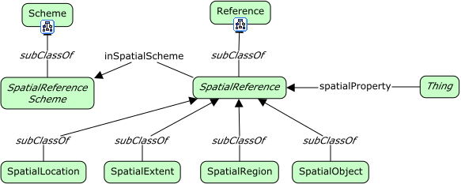

# Spacial Aspects



<span class="figure caption">Spacial Aspects</span>

## Classes

### Spacial extent

Definition:

> TBD

OWL:

```turtle
fnd:SpacialExtent a owl:Class ;
  rdfs:subClassOf fnd:SpatialReference ;
  skos:prefLabel "Spacial extent"@en ;
  skos:definition ""@en .
```

### Spacial location

Definition:

> TBD

OWL:

```turtle
fnd:SpacialLocation a owl:Class ;
  rdfs:subClassOf fnd:SpatialReference ;
  skos:prefLabel "Spacial location"@en ;
  skos:definition ""@en .
```

### Spacial object

Definition:

> TBD

OWL:

```turtle
fnd:SpacialObject a owl:Class ;
  rdfs:subClassOf fnd:SpatialReference ;
  skos:prefLabel "Spacial object"@en ;
  skos:definition ""@en .
```

### Spatial reference

Definition:

> TBD

OWL:

```turtle
fnd:SpatialReference a owl:Class ;
  rdfs:subClassOf fnd:Reference ;
  skos:prefLabel "Spatial reference"@en ;
  skos:definition ""@en .
```

### Spatial reference scheme

Definition:

> TBD

OWL:

```turtle
fnd:SpatialReferenceScheme a owl:Class ;
  rdfs:subClassOf fnd:Scheme ;
  skos:prefLabel "Spatial reference scheme"@en ;
  skos:definition ""@en .
```

### Spatial region

Definition:

> TBD

OWL:

```turtle
fnd:SpatialRegion a owl:Class ;
  rdfs:subClassOf fnd:SpatialReference ;
  skos:prefLabel "Spatial region"@en ;
  skos:definition ""@en .
```

## Properties

### spatial property

Definition:

> TBD

OWL:

```turtle
fnd:spatialProperty a owl:ObjectProperty ;
  rdfs:domain fnd:Thing ;
  rdfs:range fnd:SpatialReference ;
  skos:prefLabel "spatial property"@en ;
  skos:definition ""@en .
```

### in spatial scheme

Definition:

> TBD

OWL:

```turtle
fnd:inSpatialScheme a owl:ObjectProperty ;
  rdfs:domain fnd:SpatialReference ;
  rdfs:range fnd:SpatialReferenceScheme ;
  skos:prefLabel "in spatial scheme"@en ;
  skos:definition ""@en .
```
