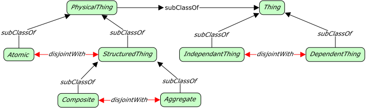
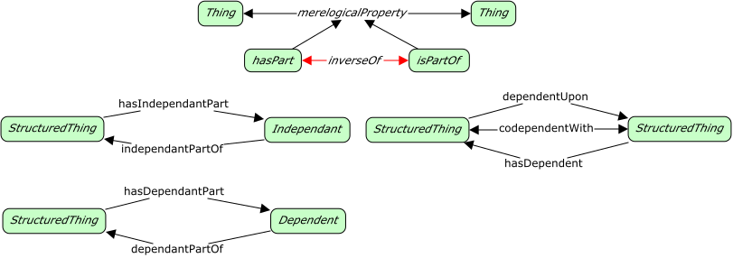

# Structural Aspects



<span class="figure caption">Structural Aspects</span>

## Classes

### Aggregate

Definition:

> An aggregate thing is one where at least some of the parts of the whole remain
> somewhat distinct and removable from it.

OWL:

```turtle
fnd:Aggregate a rdfs:Class ;
  rdfs:subClassOf fnd:PhysicalThing ;
  owl:disjointWith fnd:Composite;
  skos:prefLabel "Aggregate"@en ;
  skos:definition "..."@en .
```

### Atomic

Definition:

> An atomic thing has no parts that from which it was made, or into which it may
> be decomposed. Atomic things are disjoint with structured things.

OWL:

```turtle
fnd:Atomic a rdfs:Class ;
  rdfs:subClassOf fnd:StructuredThing ;
  owl:disjointWith Composite ;
  skos:prefLabel "Atomic"@en ;
  skos:definition "..."@en .
```

### Composite

Definition:

> A composite thing is one where the parts, once included in the whole no longer
> have any distinction from the whole and may not be *meaningfully* removed from
> it.

OWL:

```turtle
fnd:Composite a rdfs:Class ;
  rdfs:subClassOf fnd:StructuredThing ;
  owl:disjointWith fnd:Aggregate ;
  skos:prefLabel "Composite"@en ;
  skos:definition "..."@en .
```

### Dependent thing

Definition:

> A thing whose existence depends on the existence of some other thing; all
> parts of a composite are by nature dependent things.

OWL:

```turtle
fnd:DependentThing a rdfs:Class ;
  rdfs:subClassOf fnd:Thing ;
  owl:disjointWith fnd:IndependentThing ;
  skos:prefLabel "Dependent thing"@en ;
  skos:definition ""@en .
```

### Independent thing

Definition:

> A thing whose existence is not dependent on the existence of some other
> thing; at least *some* parts of an aggregate are independent things.

OWL:

```turtle
fnd:IndependentThing a rdfs:Class ;
  rdfs:subClassOf fnd:Thing ;
  owl:disjointWith fnd:DependentThing ;
  skos:prefLabel "Independent thing"@en ;
  skos:definition "..."@en .
```

### Physical thing

Definition:

>

OWL:

```turtle
fnd:PhysicalThing a rdfs:Class ;
  rdfs:subClassOf fnd:Thing ;
  skos:prefLabel "Physical thing"@en ;
  skos:definition ""@en .
```

### Structured thing

Definition:

> A thing that has some form of internal structure, it has parts whether it
> is a composite or aggregate thing. Structured things are disjoint with
> atomic things.

OWL:

```turtle
fnd:StructuredThing a rdfs:Class ;
  rdfs:subClassOf fnd:PhysicalThing ;
  owl:disjointWith fnd:Atomic ;
  skos:prefLabel "Structured thing"@en ;
  skos:definition ""@en .
```

## Properties



### codependent with

Definition:

> TBD

OWL:

```turtle
fnd:codependentWith a rdfs:Property, owl:ReflexiveProperty ;
  rdfs:domain fnd:StructuredThing ;
  rdfs:range fnd:StructuredThing ;
  skos:prefLabel "codependent with"@en ;
  skos:definition ""@en .
```

### dependent part of

Definition:

> TBD

OWL:

```turtle
fnd:dependentPartOf a rdfs:Property ;
  rdfs:subPropertyOf fnd:isPartOf ;
  owl:inverseOf fnd:hasDependentPart ;
  rdfs:domain fnd:Dependent ;
  rdfs:range fnd:StructuredThing ;
  skos:prefLabel "dependent part of"@en ;
  skos:definition ""@en .
```

### dependent upon

Definition:

> TBD

OWL:

```turtle
fnd:dependentUpon a rdfs:Property ;
  rdfs:domain fnd:StructuredThing ;
  rdfs:range fnd:StructuredThing ;
  skos:prefLabel "dependent upon"@en ;
  skos:definition ""@en .
```

### has dependent

Definition:

> TBD

OWL:

```turtle
fnd:hasDependent a rdfs:Property ;
  rdfs:domain fnd:StructuredThing ;
  rdfs:range fnd:StructuredThing ;
  skos:prefLabel "has dependent"@en ;
  skos:definition ""@en .
```

### has dependent part

Definition:

> TBD

OWL:

```turtle
fnd:hasDependentPart a rdfs:Property ;
  rdfs:subPropertyOf fnd:hasPart ;
  owl:inverseOf fnd:dependentPartOf ;
  rdfs:domain fnd:StructuredThing ;
  rdfs:range fnd:Dependent ;
  skos:prefLabel "has dependent part"@en ;
  skos:definition ""@en .
```

### has independent part

Definition:

> TBD

OWL:

```turtle
fnd:hasIndependentPart a rdfs:Property ;
  rdfs:subPropertyOf fnd:hasPart ;
  owl:inverseOf fnd:narrowerClassifier ;
  rdfs:domain fnd:StructuredThing ;
  rdfs:range fnd:Independent ;
  skos:prefLabel "has independent part"@en ;
  skos:definition ""@en .
```

### has part

Definition:

> TBD

OWL:

```turtle
fnd:hasPart a rdfs:Property ;
  rdfs:subPropertyOf fnd:merelogicalProperty ;
  rdfs:domain fnd:Thing ;
  rdfs:range fnd:Thing ;
  skos:prefLabel "has part"@en ;
  skos:definition ""@en .
```

### independent part of

Definition:

> TBD

OWL:

```turtle
fnd:independentPartOf a rdfs:Property ;
  rdfs:subPropertyOf fnd:isPartOf ;
  owl:inverseOf fnd:hasIndependentPart ;
  rdfs:domain fnd:Independent ;
  rdfs:range fnd:StructuredThing ;
  skos:prefLabel "independent part of"@en ;
  skos:definition ""@en .
```

### is part of

Definition:

> TBD

OWL:

```turtle
fnd:isPartOf a rdfs:Property ;
  rdfs:subPropertyOf fnd:merelogicalProperty ;
  rdfs:domain fnd:Thing ;
  rdfs:range fnd:Thing ;
  skos:prefLabel "is part of"@en ;
  skos:definition ""@en .
```

### merelogical property

Definition:

> TBD

OWL:

```turtle
fnd:merelogicalProperty a rdfs:Property ;
  rdfs:domain fnd:Thing ;
  rdfs:range fnd:Thing ;
  skos:prefLabel "merelogical property"@en ;
  skos:definition ""@en .
```
