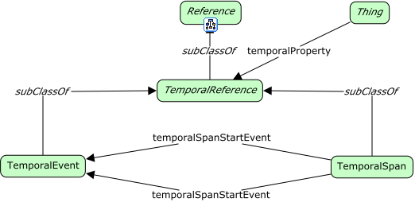

# Temporal Aspects



<span class="figure caption">Temporal Aspects</span>

## Classes

### Temporal reference

Definition:

> TBD

OWL:

```turtle
fnd:TemporalReference a owl:Class ;
  rdfs:subClassOf fnd:Reference ;
  skos:prefLabel "Temporal reference"@en ;
  skos:definition ""@en .
```

### Temporal event

Definition:

> TBD

OWL:

```turtle
fnd:TemporalEvent a owl:Class ;
  rdfs:subClassOf fnd:TemporalReference ;
  skos:prefLabel "Temporal event"@en ;
  skos:definition ""@en .
```

### Temporal span

Definition:

> TBD

OWL:

```turtle
fnd:TemporalSpan a owl:Class ;
  rdfs:subClassOf fnd:TemporalReference ;
  skos:prefLabel "Temporal span"@en ;
  skos:definition ""@en .
```

## Properties

### temporal property

Definition:

> TBD

OWL:

```turtle
fnd:temporalProperty a owl:ObjectProperty ;
  rdfs:domain fnd:Thing ;
  rdfs:range fnd:TemporalReference ;
  skos:prefLabel "temporal property"@en ;
  skos:definition ""@en .
```

### temporal span start event

Definition:

> TBD

OWL:

```turtle
fnd:temporalSpanStartEvent a owl:ObjectProperty ;
  rdfs:subPropertyOf fnd:temporalProperty ;
  rdfs:domain fnd:TemporalSpan ;
  rdfs:range fnd:TemporalEvent ;
  skos:prefLabel "temporal span start event"@en ;
  skos:definition ""@en .
```

### temporal span end event

Definition:

> TBD

OWL:

```turtle
fnd:temporalSpanEndEvent a owl:ObjectProperty ;
  rdfs:subPropertyOf fnd:temporalProperty ;
  rdfs:domain fnd:TemporalSpan ;
  rdfs:range fnd:TemporalEvent ;
  skos:prefLabel "temporal span end event"@en ;
  skos:definition ""@en .
```
