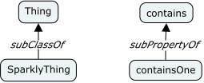
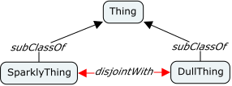
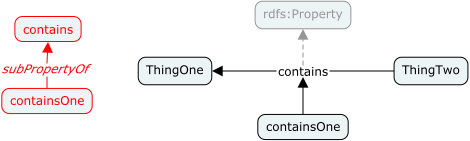
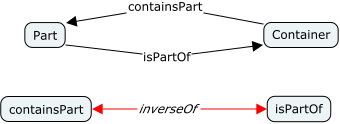

# Conceptual: CmapTools

The [IHMC CmapTools](https://cmap.ihmc.us/cmaptools/) software empowers users
to construct, navigate, share and criticize knowledge models represented as
concept maps. We use these tools because the very basis of the concept map is
rooted in a very simple set of primitives; the *concept* and the *linking
phrases* that relate concepts; that's it. You can add some styling to the
diagram, and we do, but that doesn't change the meaning in any way other than
by convention.

The CmapTools Interface

This simplicity means that the time you spend using the tools is time spent
thinking about the concepts and relations, not about which shape, which of
the many relationship types, whether this model element is allowed to be
linked to this model element in this type of diagram. It's a very direct and
immediate experience, something that also translates easily from whiteboard
or napkin sketches to computer easily and quickly.

## Building Concept Maps

Here are some useful quotes from the CmapTools web site:

- *Concept maps are graphical tools for organizing and representing knowledge
  in an organized fashion.*
- *Cmap products empowers users to construct, navigate, share and criticize
  knowledge models represented as concept maps.*
- *Concept maps express explicitly the most relevant relationships between a
  set of concepts. This relationship is depicted by means of the linking  
phrases forming propositions.*
- *In a concept map, each concept consists of the minimum number of words
  needed to express the object or event, and linking words are also as concise
  as possible and usually include a verb.*
- *It is impossible to characterize any concept without its relation to other
  concepts.*
- *More abstract concepts however cannot be described as having a cognitive
  representation as a category.*

## Specific Conventions

One convention you will see immediately is the use of the *subClassOf* linking
phrase between concepts. This should be seen as expanding to the RDF predicate
`rdfs:subClassOf` and to indicate that it is a *meta*-phrase it is always
rendered in italics as show in the following.

In some cases sub-classes of a common parent class are incompatible, that is
an individual **may not** be an instance of both classes. In OWL terms these
two classes are *disjoint*. To describe this we use a similar convention, a
linked *meta*-phrase *disjointWith* between the classes. In this case we also
color the lines red to denote that this relation acts as a constraint. This
relation expands to an `owl:disjointWith` predicate on each class definition.

RDF allows for sub-property definitions and so our concept maps should allow
us to describe them also. We dno **not** use the same convention as we do for
classes (the invalid left-hand side of the image below), instead we use the
linking phrases of the concept map as-is to define properties. In the example
below `contains` is clearly a property, however `containsOne` is also a
property because, by convention, it has an arrow that points to a linking
phrase that is not italic (linking to italic phrases has no meaning). Also,
this implies that a linking phrase could also have an arrow to another concept
which would imply that the concept is itself a property unless it's usage
elsewhere would prohibit that. In this diagram we show a greyed-out link to
the root `rdfs:Property` which is of course implied for all linking phrases
with no explicit parent.

OWL allows us to denote that one relation is the inverse of another, this is
particularly valuable in the presence of inference, but even without it is
useful knowledge and so we should capture it. We use a similar convention to
the *disjointWith* example above, as shown below. This results in the addition
of an `owl:inverseOf` predicate to each property definition.

