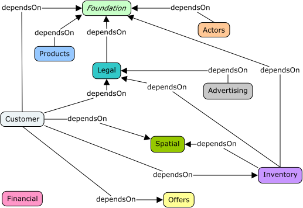

# Introduction

CeCO, the Common eCommerce Ontology, is intended as a common vocabulary for
describing the various domains of an online business-to-consumer, or
business-to-business site. While this vocabulary may also cover other cases,
or at least some of it's domains may be reusable in other areas it was
decided to keep a fixed scope so as to keep the problem bounded, even if
already large!

Ontology Overview

The figure above shows each of the different ontologies, one for each domain
plus the foundation and their dependencies. Each domain has a color used in
the diagrams throughout the rest of the book that helps show the

## Background

The resulting Ontology has been used in various forms for various tasks since
2020 growing and adding domains as necessary. Some domains are still sketchy,
some probably only have a subset of views, and so the complete set of domains
is likely incomplete for some time.

Some of these use-cases include:

1. By including among the Class and property definitions
   [SKOS Simple Knowledge Organization System (SKOS)](https://www.w3.org/TR/skos-reference/)
   concept definitions so that as well as an ontology the same resource also
   defines a Thesaurus that can more easily be rendered for purely human
   usage.
2. By building domain-specific syntaxes over RDF/OWL we enable more *ergonomic*
   tools that integrate with the ontology without having to understand the
   details of OWL. One example of this is the
   [Simple Domain Modeling Language (SDML)](https://sdml.io).
3. Entity/Domain/API model validation; key *entities* in a model should correspond
   to classes in the ontology, if they are exposed in a public API they must be
   pretty important, right? Therefore, we verify that the name of these key
   entities match labels of classes in our Ontology, and from there we can
   validate other relations outbound from the entity. This not to say anything
   we find that we do not recognize is *wrong*, it maybe our ontology is
   incomplete, but it does mean either way we want to know.

## Organization of this book

Part one of the book outlines the framework used to describe the ontology
itself, the conceptual framework as well as the tools used, and the process
by which these tools are applied. Part two is the Foundation ontology, the
*upper ontology* which is not really commerce oriented in any way but provides
a small kernel of terms that help provide cross-cutting semantics often by
way of *aspects* that are added in as necessary. Finally, part three describes
each of the commerce domains in detail.
